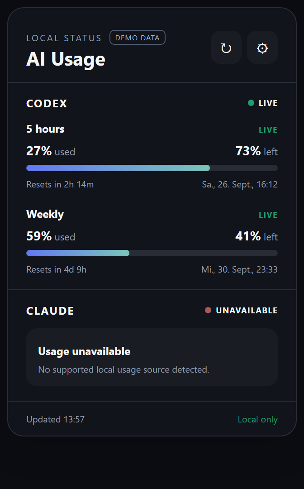

# AI Usage Widget

Lightweight Windows desktop widget for monitoring AI usage limits and reset times locally.

## Screenshot



The screenshot uses clearly marked synthetic demo values. Normal runtime has no demo mode and displays only values returned by supported local provider tooling.

## Features

- Codex local usage monitoring
- Short and weekly limit display where available
- Used and remaining percentages, reset countdowns, and reset date/time
- Explicit live, stale, and unavailable states
- System tray with show, refresh, and quit actions
- Dark, Light, and System themes
- Optional always-on-top and start-with-Windows settings
- Remembered window position and close-to-tray behavior
- Privacy-first local operation with no application telemetry

## Provider Support

| Provider | Status | Local source |
|---|---|---|
| Codex | **Supported** | The installed `codex app-server --stdio`, using only `account/rateLimits/read` fields. |
| Claude | **Adapter included; usage currently unavailable** | No safe supported local usage source has been verified. The adapter remains ready for a future official interface. |

AI Usage Widget never estimates a missing provider value. One provider can remain unavailable without affecting the other.

## Privacy

- No telemetry, analytics, cloud backend, or account system
- No website or browser scraping
- No browser cookies or browser storage access
- No prompt, conversation, project, or file upload
- No Codex or Claude credential extraction or transmission
- No raw provider response persistence
- Codex usage is requested through the locally installed Codex app-server and narrowed to percentages, window duration, and reset time
- Claude private sessions and credentials are intentionally not parsed

See [PRIVACY.md](PRIVACY.md) and [SECURITY.md](SECURITY.md) for the precise boundaries.

## Installation

Download `AI Usage Widget_0.1.0_x64-setup.exe` from a GitHub release. The NSIS installer is per-user and does not require administrator privileges.

An MSI is intentionally not published for 0.1.0: the tested WiX bundle required an all-users installation and administrator privileges, which conflicts with this utility's normal-user design.

Release-candidate artifacts are unsigned. Windows SmartScreen may warn because the publisher has not established code-signing reputation. Verify the artifact against the published `SHA256SUMS.txt`. See [Code signing](docs/CODE_SIGNING.md) and [Installer behavior](docs/INSTALLER_BEHAVIOR.md).

## Development

Prerequisites: Windows 10/11, Rust 1.88 or newer, Tauri's Windows prerequisites, and the Tauri CLI. Codex live values require a locally installed and authenticated Codex CLI.

```powershell
# Development
cargo tauri dev

# Tests
cargo test --manifest-path src-tauri/Cargo.toml

# Lint
cargo fmt --manifest-path src-tauri/Cargo.toml --all -- --check
cargo clippy --manifest-path src-tauri/Cargo.toml --all-targets -- -D warnings

# Build executable and NSIS installer
cargo tauri build

# Secret scan (requires gitleaks on PATH)
powershell -File scripts/secret-scan.ps1
```

The frontend is bundled static HTML/CSS/JavaScript. The application does not start a localhost server and does not require Node.js at runtime.

## Limitations

- Windows is the supported 0.1.0 platform.
- Codex monitoring requires the local Codex installation and its existing authentication.
- Claude usage is not currently available.
- A provider may expose only one usage window; the widget does not invent the other.
- Unsigned releases may trigger Windows SmartScreen.
- Provider interfaces can change; unsupported data fails closed to `UNAVAILABLE`.

Dependency warnings and their reachability decisions are documented in [Dependency security](docs/DEPENDENCY_SECURITY.md).

## Contributing

Read [CONTRIBUTING.md](CONTRIBUTING.md). Create test fixtures synthetically, never from real provider files, and run the secret scan before every commit.

## Unofficial Project

This project is unofficial and is not affiliated with, endorsed by, or sponsored by OpenAI or Anthropic.

OpenAI, Codex, Anthropic, and Claude are trademarks of their respective owners. Their logos are not used by this project.
